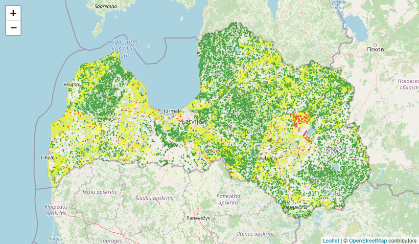

# forest-fires-front

> This application was developed for [LATA atverto ģeotelpisko datu hakatons skoleniem 2021](https://www.lata.org.lv/skolas-2021). Developed by `tea.spill(keyboard)` command.

Application displays `GeoJSON` layer, which are generated by our [backend part](https://github.com/akorny/forest-fires-back). Written in `React`, using `Bootstrap 5`, `Leaflet`, `react-leftleat`, `react-router-dom`, `react-json-view`, `react-latex`, `react-router-hash-link`.  
Website is located [here](https://tea-spill-keyboard.id.lv).  
